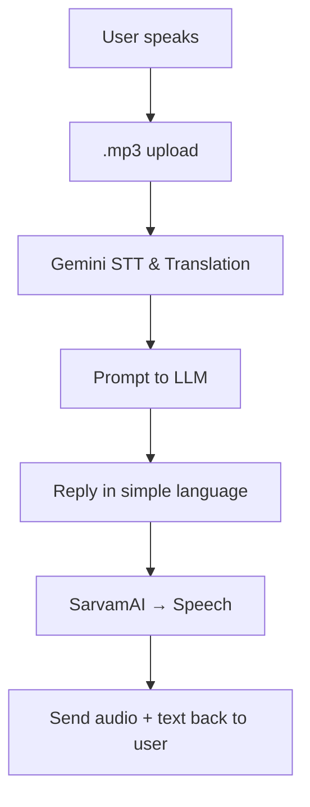

# 🩺 SahaAI – Village Health Assistant Bot

A **voice-first, AI-powered rural health assistant** that understands and responds in **Odia** and **English**.  
Built for Bharat’s rural heartlands. Simple. Human. Scalable.

> 🧠 Powered by **Gemini** & **SarvamAI**  
> ⚙️ Built with **FastAPI + React**  
> 📱 Speech ↔️ Text in **Odia & English**  
> 🚀 Ready for **Firebase Deployment**

---

## 🌟 Features at a Glance

| Capability          | Description                                                                 |
|---------------------|-----------------------------------------------------------------------------|
| 🎙️ Voice Input       | Users can **speak directly** to the bot in Odia or English                  |
| 🔄 STT & Translation | **Gemini** handles **speech-to-text** and **Odia ↔️ English translation**    |
| 🗣️ Realistic TTS     | **SarvamAI** converts AI replies into **natural regional voice**            |
| 🧩 Modular Chat API  | Plug in any LLM (Claude, Gemini, OpenRouter) via `Services/openrouter.py`   |
| 🧑‍💻 Fullstack Ready  | Modular **React frontend** + **FastAPI backend**                            |
| 🔥 Firebase Ready    | REST APIs are compatible with **Cloud Functions** for easy deployment       |

---

## 🛠️ Tech Stack


- **Backend**: FastAPI (Python 3.9+)
- **Frontend**: React + Tailwind CSS
- **AI & Audio**:
  - Google **Gemini** (STT + LLM)
  - **SarvamAI** (Text-to-speech for Indian languages)
- **Audio Handling**: `.mp3` uploads, `.wav` synthesis, `ffmpeg` + `pydub`
- **Deployment Options**: Firebase Functions or any cloud server
- **Secrets**: `.env` files for API keys

---

## 📦 Project Structure

```
village-health-assistant/
│
├── Services/                  # Modular API wrappers
│   ├── stt.py                 # Gemini: Speech to Text
│   ├── tts.py                 # SarvamAI: Text to Speech
│   ├── openrouter.py          # LLM Prompt Handler
│
├── tts_output/                # Stores generated voice files
├── mps_TEST/                  # Local audio test assets
├── main.py                    # FastAPI routes
├── .env                       # Your API keys go here
└── README.md
```

---

## 🧬 How It Works



🎯 Your assistant *listens, understands, speaks back* — in the user’s own language.

---

## 🚀 Quick Start (Local Setup)

1. **Clone the Repo**
```bash
git clone https://github.com/your-username/village-health-assistant.git
cd village-health-assistant
```

2. **Install Python Requirements**
```bash
pip install -r requirements.txt
```

3. **Add `.env` File**
```env
OPENROUTER_API_KEY=sk-...
SARVAMAI_API_KEY=your_sarvam_key
```

4. **Start Backend**
```bash
uvicorn Main:app --reload --host 0.0.0.0 --port 8000
```

5. **Frontend Setup**
```bash
cd frontend
npm install
npm run dev
```

---

## 📱 Mobile Demo (Local to Phone)

Make sure:
- Both phone + laptop on same Wi-Fi  
- Use your **local IP** in frontend API calls (`http://192.168.x.x:8000`)  
- Run backend with:
```bash
uvicorn Main:app --host 0.0.0.0 --port 8000
```

Now open frontend from mobile:  
`https://project-village-health-bot.vercel.app`

---

## 🧠 Future Scope

- ✅ Add more Indian languages (Bengali, Telugu, etc.)
- 📞 Integrate IVR or WhatsApp for feature-phone users
- 📊 Collect anonymous health insights for NGOs
- 🔌 Offline support with cached responses

---

## ❤️ Made at [Odia Gen AI Hackathon 2025] by Team SahaAI

> Designed for rural inclusion. Built with empathy. Scaled with AI.  
>  
> 🎤 Powered by your voice. Replied with care.

---
